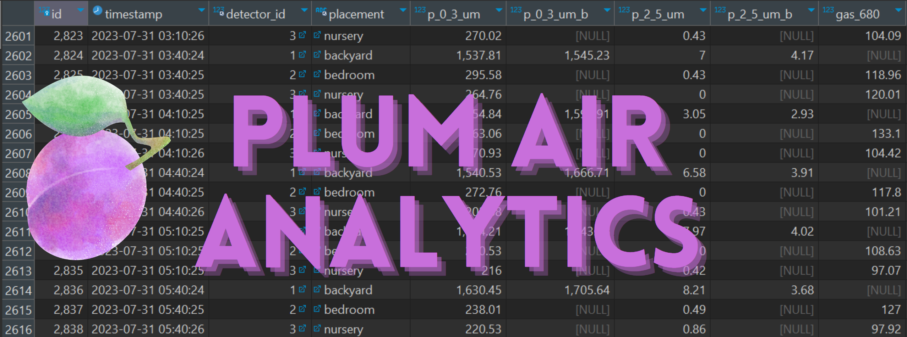

# What is this?
Plum Air Analytics is the back-end portion of a two-part application. [Plum Air Visualizer](https://github.com/markrai/plum-air-visualizer) Currently, it queries your Purple Air™ sensors, and writes the data to a MySQL database.
The metrics which are captured include PM 2.5 values, as well as VOC values (if available).

The data is polled every 30 minutes.

The data can be extracted from the DB, and used for conducting analytics.

As a fun exercise, try feeding the data to Chat-GPT's code-interpreter feature, and ask it to find correlations, and trends! 😁

# Requirements
This app relies on a connection to a MySQL database. The DDL scripts for the creation of the schema can be found in
/resources/sql folder. 

# How do I run it?
As this is a Spring Boot application, the entry point of the application can be found at: PlumAirAnalyticsApplication.java

The application.properties file is parameterized, so you will have to provide the following environment variables in the run configuration of your IDE:

SERVER_PORT=8080

DB_HOST=[###.###.###.###];

DB_PORT=[Usually 3306 for MySQL];

DB_NAME=[name of datbase];

DB_PASSWORD=[*********];

DB_USERNAME=[*********];

# Future Plans

I intend to gather data from my ecobee™ thermostat, as well as outdoor temperature and humidity data, which would make for interesting insights.
Another thing to try might be to fetch data from PurpleAir™ sensors from the surrounding neighborhood, and correlate it with my residential data.
Finally, report generation is something that can be implemented as well, with the existing data.

As the data grows, certain considerations will come into play so that latency issues do not develop on the [Plum Air Visualizer](https://github.com/markrai/plum-air-visualizer) app.